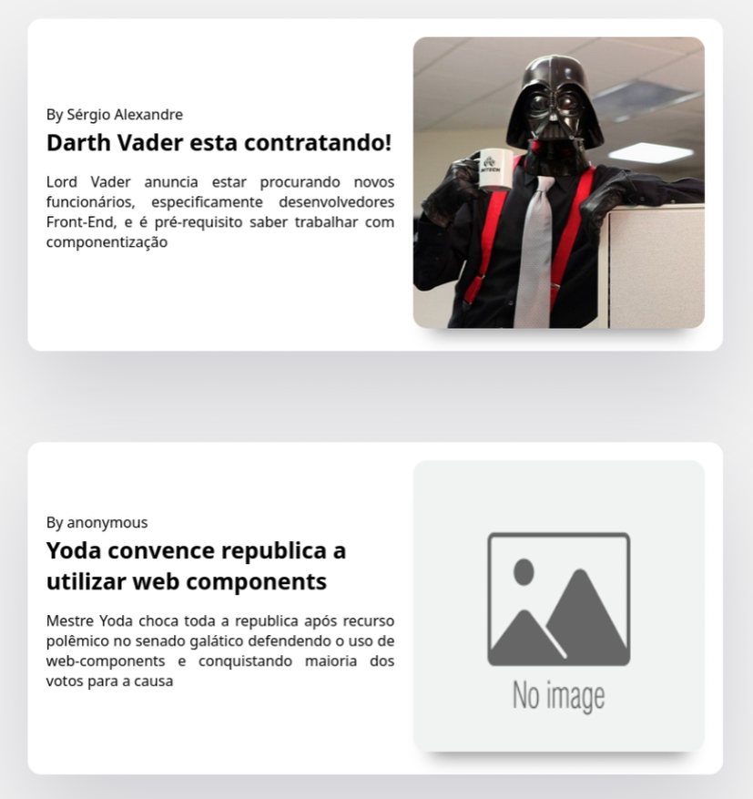

# Web Component - JavaScript Only

Este é um exemplo de **Web Component** criado com JavaScript puro, sem a necessidade de bibliotecas ou frameworks externos. O componente é inspirado no estilo de postagens do Medium, fornecendo uma interface limpa e responsiva para exibir notícias.

## 💡 Funcionalidades

- **Estrutura Modular:** Código organizado e dividido em métodos reutilizáveis.
- **Personalizável:** Você pode definir atributos como `autor`, `title`, `link-url`, `image-src`, `image-alt` e `content` diretamente no HTML.
- **Estilo Clean:** Design moderno com CSS puro, inspirado em interfaces minimalistas.
- **Isolamento com Shadow DOM:** O componente utiliza Shadow DOM para garantir encapsulamento e evitar conflitos de estilo.

## 🖼️ Demonstração




## 🚀 Como Usar

1. Clone o repositório:

```bash
   git clone https://github.com/seu-usuario/web-component-javascript-only.git
   cd web-component-javascript-only
```

2. Abra o arquivo `index.html` no seu navegador:
     - Ou arraste o arquivo diretamente para o navegador.

3. **Adicione um novo componente:** Insira o seguinte HTML no arquivo `index.html`, substituindo os atributos conforme necessário:
    
    ```html
    <card-news
        autor="Nome do Autor"
        title="Título da Notícia"
        link-url="https://exemplo.com"
        image-src="assets/exemplo.jpg"
        image-alt="Descrição da Imagem"
        content="Resumo da notícia aqui."
    ></card-news>
    ```
    

## 📜 Exemplos no Projeto

### Exemplo 1

```html
<card-news
    autor="Sérgio Alexandre"
    title="Darth Vader está contratando!"
    link-url="#"
    image-src="assets/coffee-vader.jpg"
    image-alt="Darth Vader bebendo café em um escritório"
    content="Lord Vader anuncia estar procurando novos funcionários, especificamente desenvolvedores Front-End, e é pré-requisito saber trabalhar com componentização."
></card-news>
```

### Exemplo 2

```html
<card-news
    title="Yoda convence república a utilizar web components"
    link-url="#"
    content="Mestre Yoda choca toda a república após recurso polêmico no senado galático defendendo o uso de web-components e conquistando maioria dos votos para a causa."
></card-news>
```


## 🛠️ Tecnologias Utilizadas

- **HTML**: Estrutura da página e uso do Web Component.
- **CSS**: Estilos globais e encapsulados no Shadow DOM.
- **JavaScript (ES6+)**: Criação e lógica do Web Component.


Feito com ❤️ por [Sérgio Alexandre](https://github.com/Serg-Ale)
